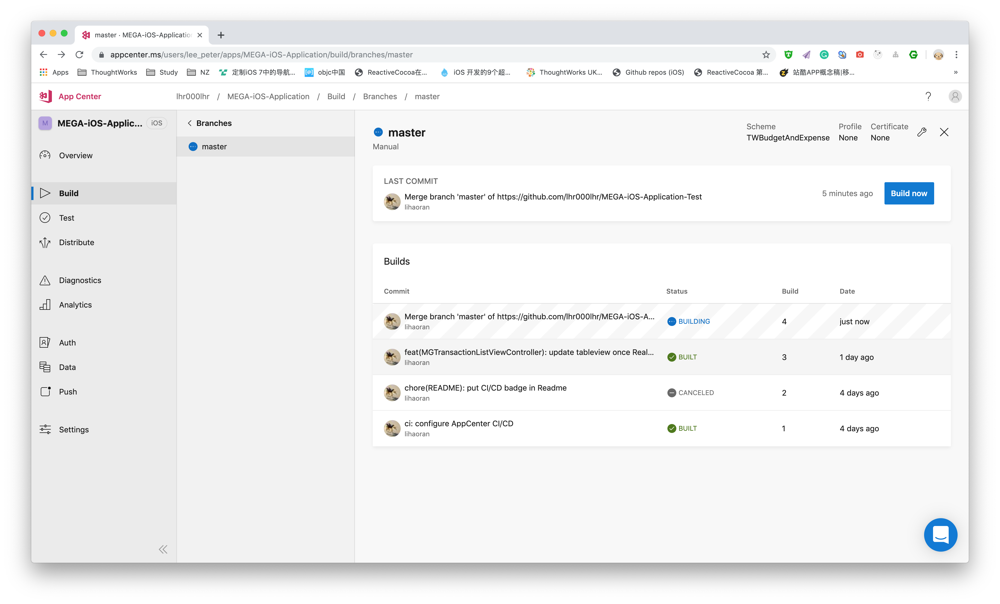

# MEGA-iOS-Application-Test

A Budget Manager base on `Objective-C` and `ReactiveCocoa`


## CI/CD

AppCenter

[](https://appcenter.ms)



## Start

```bash
git clone https://github.com/lhr000lhr/MEGA-iOS-Application-Test.git
cd MEGA-iOS-Application-Test/
pod install
```
## Screenshots

| Chart      | Transaction| Category |
| ---------- | ---------- |----------|
| ![Chart][1] | ![Transaction][2] |![Category][3]


---
### Directory

```
.
├── API
│   └── Models
├── Addtions
│   └── Tools
├── Assets.xcassets
├── Base.lproj
├── Items
├── Modules
│   ├── BaseControllers
│   ├── Category
│   │   ├── Model
│   │   ├── View
│   │   └── ViewModel
│   ├── Charts
│   │   └── View
│   └── Transaction
│       ├── Model
│       ├── View
│       └── ViewModel
└── Protocols

```
## Test

Based on <a href='https://github.com/kiwi-bdd/Kiwi'>Kiwi🥝</a>


#### License
<a rel="license" href="http://creativecommons.org/licenses/by-nc-nd/4.0/"></a><br />This work is licensed under a <a rel="license" href="http://creativecommons.org/licenses/by-nc-nd/4.0/">Creative Commons Attribution-NonCommercial-NoDerivatives 4.0 International License</a>.
 


[1]: ./screenshots/Chart.png
[2]: ./screenshots/Transaction.png
[3]: ./screenshots/Category.png